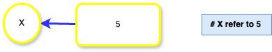
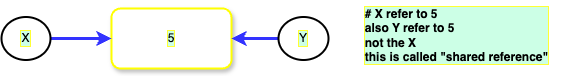
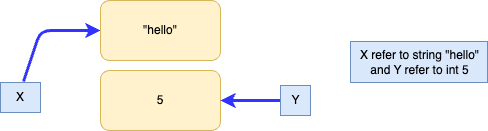
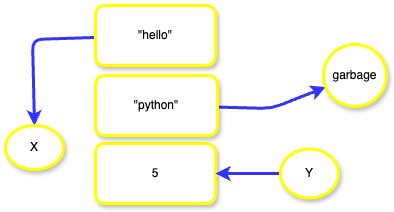

# Object Reference in Python

    let assign x variable a value 5

    When x = 5 is executed, Python creates an object to represent the value 5 and makes x reference this object.

    Now, if we assign another variable y to the variable x.
    y = x

    Python encounters the first statement, it creates an object for the value 5 and makes x reference it. The second statement creates y and references the same object as x, not x itself. This is called a **Shared Reference**, where multiple variables reference the same object.

    now if we write 

    x = 6 or "hello" or 5+1

        Python creates a new object for the value  and makes x reference this new object.

    The variable y remains unchanged, still referencing the original object 5.

    If we now assign a new value to y
    y = "python"

    Python creates yet another object for "Computer" and updates y to reference it.
    The original object 5 no longer has any references and becomes eligible for garbage collection.

## Key Takeaways:
    Python variables hold references to objects, not the actual objects themselves.
    Reassigning a variable does not affect other variables referencing the same object unless explicitly updated.